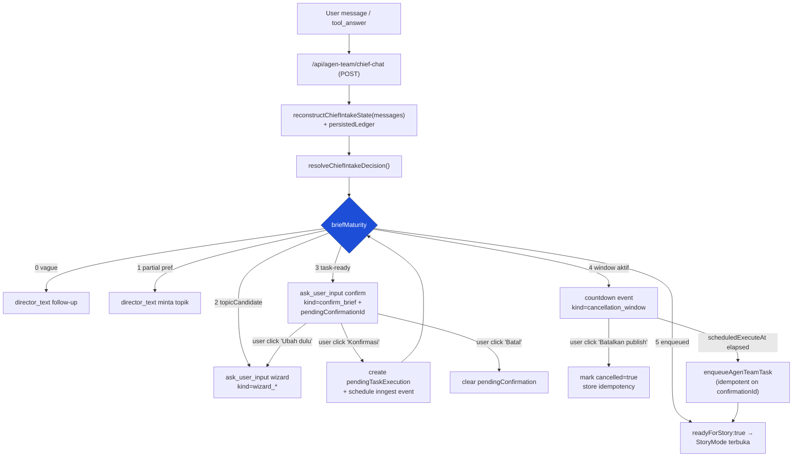
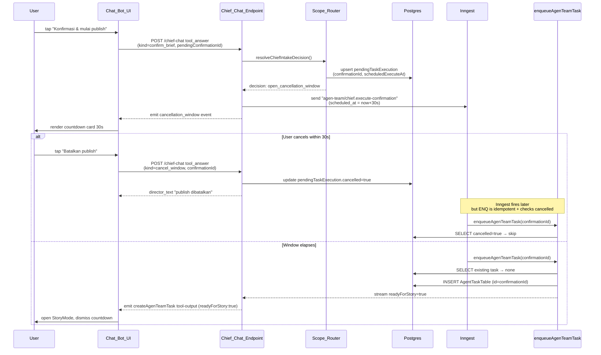

# Design Document

## Overview

Dokumen ini menjelaskan desain teknis untuk **Chief Chat (Pak Arga) v3**. v3 mempertahankan persona dan jalur LangGraph yang sudah ada (`writer → marketing_pre_publish → social_media → publish`) tetapi merombak jalur intake supaya tiga perilaku inti hasil audit v2 menjadi deterministik dan dapat ditest:

1. **`briefMaturity` (0..5) sebagai gate utama** di `Scope_Router`. Switch utama keputusan berhenti memakai kombinasi flag ad-hoc (`readyForConfirmation`, `confirmed`, `hasPendingConfirmation`) dan beralih ke level numerik dengan transisi eksplisit. Tipe `pendingConfirmation` dipersempit ke kontrak auto-publish default.
2. **Wizard cerdas dengan free-text dan slot skipping**. `askUserInput` v3 hanya membangun pertanyaan untuk slot yang missing/ambiguous, menampilkan input free-text di samping tombol di `Interactive_Overlay`, dan mengirim marker `kind` eksplisit ke endpoint sehingga deteksi konfirmasi tidak lagi bergantung pada regex teks pertanyaan.
3. **Cancellation window 30 detik**. Tombol konfirmasi tidak langsung memanggil `enqueueAgenTeamTask`. Sebaliknya, sistem membuat `pendingTaskExecution` dengan `scheduledExecuteAt = now + 30s`, menampilkan countdown overlay di klien, dan baru mengeksekusi enqueue (idempotent, berbasis `confirmationId`) setelah window habis tanpa pembatalan. `StoryMode` baru terbuka setelah enqueue berhasil.

Desain ini juga merapikan tiga pekerjaan turunan yang disebut requirements: (a) push-back / advisory notes ketika scope-router mendeteksi konflik antar slot, (b) jawaban natural-text yang jujur saat user meminta platform yang tidak didukung, dan (c) deprecation jalur legacy (`chief_message`, `run_task`, `ChiefChat.tsx`, `chief-router.ts`) ke balik feature flag `AGEN_TEAM_LEGACY_API_ENABLED` sehingga gate v3 menjadi entry point tunggal ke pipeline.

### Tujuan desain (non-goals diluar scope ada di requirements §Out of Scope)

- Determinisme: keluaran Scope_Router untuk `(thread_history, current_message, ledger_state)` yang sama harus identik di setiap pemanggilan, kecuali bagian yang sengaja menggunakan random `confirmationId`.
- Idempotensi enqueue: satu `confirmationId` menghasilkan paling banyak satu task di pipeline LangGraph, walaupun trigger eksekusi datang dari beberapa jalur.
- Payload freeze: payload yang dikirim ke `enqueueAgenTeamTask` adalah snapshot dari `pendingConfirmation` saat user menekan konfirmasi, bukan rebuild dari `Brief_Ledger` saat eksekusi.
- LLM tidak punya otoritas untuk men-trigger task; LLM hanya boleh menggenerate teks natural atau fallback parsing slot.

### Dampak ringkas terhadap modul existing

| Modul | Status | Jenis perubahan |
| --- | --- | --- |
| `src/lib/agen-team/chief/scope-router.ts` | Refactor besar | Tambah maturity 5, pendingTaskExecution, marker-based dispatch, slot detector layered, advisory notes; hapus reliance pada regex teks. |
| `src/app/api/agen-team/chief-chat/route.ts` | Refactor | Hapus enqueue inline; emit confirmation event + jadwalkan eksekusi backend; balas `readyForStory` hanya setelah enqueue. |
| `src/lib/agen-team/create-task.ts` | Refactor kecil | Idempotency token berbasis `confirmationId`, tidak lagi men-generate `task_id` random per call. |
| `src/lib/inngest/functions.ts` | Tambah | Fungsi baru `chief-execute-confirmation` yang sleep 30 detik lalu memanggil enqueue. |
| `src/lib/ai/tools/interactive-input.ts` | Refactor schema | Tambah field `kind` & `pendingConfirmationId` di input; tambah dukungan free-text via flag opsional. |
| `src/components/interactive-overlay.tsx` | Refactor | Render free-text input, render countdown card, render advisory card. |
| `src/components/chat-bot.tsx` | Refactor mode `agen-team-chief` | Tunda pembukaan StoryMode sampai `readyForStory: true`; render countdown via tool output baru. |
| `src/app/api/agen-team/route.ts` | Deprecation | Action `chief_message` & `run_task` → 410 Gone, kecuali flag aktif. |
| `src/components/agen-team/ChiefChat.tsx` | Sunset | Hapus impor dari rute aktif (file tetap ada sebagai dead code per Out of Scope). |
| `src/lib/agen-team/agents/chief-router.ts` | Sunset | Hanya dipanggil di balik flag dev. |

## Architecture

### Diagram alur intake v3



### Diagram sequence cancellation window



### Pemilihan jalur eksekusi (server-driven, bukan client-trigger)

Requirement 5.12 meminta keputusan eksplisit untuk skenario "user menutup tab selama window". Desain v3 memilih **jalur scheduled-backend (Inngest)** sebagai sumber eksekusi resmi:

- **Alasan**: idempotensi dan reliability. Klien tidak dapat dipercaya menjadi pemicu publish karena bisa hilang koneksi, refresh, atau timer di browser di-throttle oleh tab inaktif.
- **Mekanisme**: saat tombol konfirmasi ditekan, server mengirim event Inngest `agen-team/chief.execute-confirmation` dengan opsi penjadwalan (`scheduled_utc = now + 30s`). Inngest memanggil handler yang memvalidasi state cancellation lalu memanggil `enqueueAgenTeamTask` yang sudah idempotent.
- **Klien hanya rendering**: client menampilkan countdown lokal (decrementing setiap detik dari `scheduledExecuteAt - now`) untuk UX, tetapi tidak men-trigger enqueue. Ketika countdown habis, klien melakukan polling ringan (atau menerima push via streaming endpoint) untuk mendeteksi event `readyForStory:true` dari server.
- **Cancel path**: tombol "Batalkan publish" memanggil endpoint pembatalan yang menulis `pendingTaskExecution.cancelled = true` ke DB. Handler Inngest yang berjalan setelahnya akan membaca flag tersebut dan skip enqueue.

### Persistensi state

Brief_Ledger dan pendingTaskExecution dipersist agar tahan refresh dan multi-jalur trigger.

- **Tabel baru `chief_brief_ledger`** (Postgres, Drizzle): primary key `(threadId)`, kolom `ledger jsonb`, `pending_confirmation jsonb`, `pending_task_execution jsonb`, `updated_at`. Skema ledger memakai `zod` schema yang sama dengan in-memory state.
- **Tabel baru `chief_confirmation_idempotency`**: primary key `(confirmation_id)`, kolom `task_id text NOT NULL` (= `confirmation_id`), `user_id`, `created_at`, `cancelled_at NULL`, `enqueued_at NULL`. Tabel ini menjadi sumber tunggal idempotensi enqueue (Requirement 6.2).
- **Reuse `AgentTaskTable`**: `task_id` di-set sama dengan `confirmation_id`. Ini menggantikan generasi UUID baru per call di `enqueueAgenTeamTask` sehingga retry dengan `confirmationId` yang sama dijamin idempotent oleh kunci primer DB (Requirement 6.1).

## Components and Interfaces

Bagian ini mendefinisikan kontrak modul yang berubah. Semua tipe baru divalidasi dengan `zod` (lihat Data Models) dan tipe TypeScript-nya diturunkan via `z.infer`.

### `src/lib/agen-team/chief/scope-router.ts`

API publik yang baru / berubah:

```ts
export type BriefMaturity = 0 | 1 | 2 | 3 | 4 | 5;

export type Marker =
  | "wizard_platform"
  | "wizard_format"
  | "wizard_topic"
  | "wizard_goal"
  | "wizard_visual"
  | "confirm_brief"
  | "correction"
  | "cancel_brief"
  | "cancel_window"
  | "advisory_continue"
  | "advisory_change";

export type ToolAnswerSignal = {
  kind: "tool_answer";
  marker: Marker;
  pendingConfirmationId?: string;
  answer: string; // raw button label or free-text
};

export type IntakeDecision =
  | { type: "ask_user_input"; payload: AskUserInputPayloadV3; assistantText: string; state: ChiefIntakeState }
  | { type: "director_text"; instruction: string; fallbackText: string; state: ChiefIntakeState }
  | { type: "open_cancellation_window"; confirmationId: string; scheduledExecuteAt: string; state: ChiefIntakeState }
  | { type: "cancel_window_acknowledged"; confirmationId: string; state: ChiefIntakeState }
  | { type: "ready_for_story"; taskId: string; state: ChiefIntakeState };

export function resolveChiefIntakeDecision(args: {
  messages: ChiefMessageLike[];
  persistedLedger: BriefLedger | null;
  now: Date;
  newConfirmationId: () => string;
}): IntakeDecision;

export function detectSlotsFromFreeText(
  text: string,
  ledger: BriefLedger,
): SlotDetectionResult;
```

Perubahan struktural penting:

- `resolveChiefIntakeDecision` menerima `persistedLedger` + injector `newConfirmationId` (untuk testability & determinisme).
- Switch utama hanya pada `state.briefMaturity`. Helper-flag (`readyForConfirmation`, `confirmed`, `correctionRequested`) tetap dihitung di `finalizeState` tapi hanya untuk membentuk maturity dan menyesuaikan keputusan _di dalam_ level (Requirement 2.8).
- Decision lama `create_task` dihapus dari Scope_Router. Enqueue tidak lagi dipicu dari Scope_Router; ia hanya menerbitkan event window/story.
- `Slot_Detector` (`detectSlotsFromFreeText`) membungkus heuristics berlapis yang sudah ada (`detectPlatform`, `detectFormat`, `detectGoal`, `inferTopicFromFreeText`, `detectVisualSource`) menjadi satu pipeline:
  1. **Layer 1 — keyword**: regex/whitelist berdasarkan slot context (`marker`).
  2. **Layer 2 — sinonim & normalisasi**: lowercase, strip emoji, fuzzy match daftar kata kunci (`carousel`, `feed`, `edukasi`, `promo`, dst.).
  3. **Layer 3 — fallback LLM**: panggil director dalam mode "slot extraction" hanya jika layer 1+2 gagal _dan_ marker tersedia. LLM hanya boleh mengembalikan JSON slot, bukan keputusan gate (NFR1).

### `src/app/api/agen-team/chief-chat/route.ts`

POST handler tetap streaming `createUIMessageStream`, tetapi dispatch berubah:

```ts
switch (decision.type) {
  case "ask_user_input":
    emitText(dataStream, decision.assistantText);
    emitAskUserInput(dataStream, decision.payload); // payload.input membawa marker + pendingConfirmationId
    return;
  case "director_text":
    await streamDirectorText({ ... });
    return;
  case "open_cancellation_window":
    await persistPendingTaskExecution(decision);
    await scheduleConfirmationExecution(decision);
    emitCancellationWindow(dataStream, decision); // tool-output baru, BUKAN createAgenTeamTask
    return;
  case "cancel_window_acknowledged":
    await markPendingTaskExecutionCancelled(decision.confirmationId);
    emitText(dataStream, "Saya batalkan publish-nya. Tidak ada konten yang diunggah.");
    return;
  case "ready_for_story":
    emitCreateTaskOutput(dataStream, { taskId: decision.taskId, readyForStory: true });
    return;
}
```

`emitCancellationWindow` mengirim tool output dengan `toolName = "agenTeamCancellationWindow"` (tool baru, schema-only di registry untuk konsistensi tipe) dan `output: { confirmationId, scheduledExecuteAt, durationSeconds: 30, status: "armed" }`. Ini BUKAN `createAgenTeamTask`, sehingga klien tidak akan keliru membuka StoryMode (Requirement 13.3).

`scheduleConfirmationExecution` mengirim event Inngest:

```ts
await inngest.send({
  name: "agen-team/chief.execute-confirmation",
  data: { confirmationId, userId, scheduledExecuteAt },
});
```

Endpoint baru `POST /api/agen-team/chief-chat/cancel`:

- Body: `{ confirmationId: string }`
- Auth: session user yang sama dengan pemilik thread.
- Aksi: validasi kepemilikan → `UPDATE chief_confirmation_idempotency SET cancelled_at = now() WHERE confirmation_id = $1 AND enqueued_at IS NULL`.
- Response: `{ ok: true, status: "cancelled" | "already_enqueued" | "already_cancelled" }`.

### `src/lib/inngest/functions.ts`

Fungsi baru:

```ts
export const chiefExecuteConfirmation = inngest.createFunction(
  { id: "chief-execute-confirmation", concurrency: { key: "event.data.confirmationId", limit: 1 } },
  { event: "agen-team/chief.execute-confirmation" },
  async ({ event, step }) => {
    const { confirmationId, userId, scheduledExecuteAt } = event.data;

    await step.sleepUntil("cancellation-window", new Date(scheduledExecuteAt));

    const row = await step.run("load-idempotency-row", () =>
      loadConfirmationRow(confirmationId, userId),
    );

    if (!row) return { skipped: "missing_pending" };
    if (row.cancelled_at) return { skipped: "cancelled" };
    if (row.enqueued_at) return { skipped: "already_enqueued" };

    const snapshot = await step.run("load-snapshot", () =>
      loadPendingConfirmationSnapshot(confirmationId, userId),
    );

    const result = await step.run("enqueue-task", () =>
      enqueueAgenTeamTask(buildAgenTeamPayloadFromSnapshot(snapshot, confirmationId)),
    );

    await step.run("mark-enqueued", () =>
      markConfirmationEnqueued(confirmationId, result.taskId),
    );

    await step.run("notify-stream", () =>
      publishReadyForStory(userId, snapshot.threadId, result.taskId),
    );
  },
);
```

Catatan: `concurrency.limit = 1` per `confirmationId` mencegah double-trigger paralel (Requirement 6.3). Idempotensi tetap dijamin di DB lewat primary key `task_id = confirmationId` (Requirement 6.1, 6.4).

`publishReadyForStory` adalah helper yang mengirim notifikasi via channel realtime yang sudah tersedia (atau mem-bookmark state agar polling ringan klien melihat `readyForStory:true` saat user kembali). Karena project belum punya WS, jalur fallback: klien melakukan **fetch ringan** ke `GET /api/agen-team/chief-chat/confirmation-status?confirmationId=...` saat countdown lokal mencapai 0; endpoint mengembalikan `{ status: "armed" | "cancelled" | "enqueued", taskId? }`.

### `src/lib/agen-team/create-task.ts`

Perubahan minimum:

```ts
export async function enqueueAgenTeamTask(
  payload: AgenTeamTaskPayload,
  traceId = generateUUID(),
): Promise<{ taskId: string; status: "created" | "queued" | "running" | "scheduled" | "already_exists" | "rate_limited" }>;
```

Sekarang `payload.task_id` HARUS sama dengan `confirmationId`. Caller (Inngest handler) bertanggung jawab menyetel ini. Loop SELECT-then-INSERT yang sudah ada di fungsi ini cukup untuk menjamin idempotensi (Requirement 6.8) tetapi:

- Kita tambahkan transaksi `BEGIN; SELECT ... FOR UPDATE; INSERT;` agar dua proses paralel (Inngest + retry) tidak race.
- `mapChiefToolInputToRunTaskPayload` menerima `confirmationId` opsional dan memetakannya ke `task_id`.

### `src/lib/ai/tools/interactive-input.ts`

`askUserInputTool` v3 menambah dua field opsional di input:

```ts
inputSchema: z.object({
  type: z.enum(["single_select", "multi_select", "rank_priorities"]),
  message: z.string().optional(),
  questions: z.array(z.object({
    question: z.string(),
    options: z.array(z.string()).max(4),
  })).max(3),
  // v3 additions
  kind: ChiefMarkerSchema.optional(),
  pendingConfirmationId: z.string().uuid().optional(),
  allowFreeText: z.boolean().optional().default(true),
  freeTextPlaceholder: z.string().optional(),
}),
```

`ChiefMarkerSchema` adalah enum dari Marker di Scope_Router. Tool tetap schema-only (LLM tidak perlu tahu marker; marker di-inject oleh Scope_Router lewat `emitAskUserInput`).

### `src/components/interactive-overlay.tsx`

Komponen overlay menerima props baru via tool input:

- Bila `kind` = `"confirm_brief"`, `"wizard_*"`, atau `"correction"`, render free-text input di bawah opsi (Requirement 3.3, 4.5).
- Bila `kind` = `"cancellation_window"` (dispatched bukan via askUserInput tetapi via tool output `agenTeamCancellationWindow`), render countdown card khusus dengan progress bar dan tombol "Batalkan publish".
- Bila `kind` = advisory (`"advisory_continue"`/`"advisory_change"`), render Limitations_Card.

Ketika user menekan tombol atau submit free-text, klien mengirim payload tool_answer:

```ts
type ToolAnswerToServer = {
  kind: Marker;
  pendingConfirmationId?: string;
  answer: string; // label tombol atau free-text apa adanya
};
```

Klien TIDAK melakukan parsing; semua parsing dilakukan oleh Slot_Detector di server.

### `src/components/chat-bot.tsx`

Mode `agen-team-chief` ditambah handling baru:

- Saat tool output `agenTeamCancellationWindow` masuk, klien membuka `CountdownCard` dengan `confirmationId` & `scheduledExecuteAt`. Klien TIDAK memanggil `onAgenTeamTaskCreated`.
- Saat tool output `createAgenTeamTask` masuk dengan `readyForStory: true` (Requirement 13.5), klien menutup countdown card dan memanggil `onAgenTeamTaskCreated(taskId)` untuk membuka StoryMode.
- Saat tool output `createAgenTeamTask` masuk dengan `readyForStory: false`, klien menampilkan teks error dan tidak membuka StoryMode (Requirement 13.6).

### `src/app/api/agen-team/route.ts` (legacy)

Aksi `chief_message` dan `run_task`:

```ts
const legacyEnabled = process.env.AGEN_TEAM_LEGACY_API_ENABLED === "true";
if (action === "chief_message" || action === "run_task") {
  if (!legacyEnabled) {
    logger.warn("legacy chief router called without flag", { action, userId });
    return new Response("Gone", { status: 410 });
  }
  // dev-only path
}
```

### `src/components/agen-team/ChiefChat.tsx` & `src/lib/agen-team/agents/chief-router.ts`

Tidak diimpor dari rute aktif manapun. Verifikasi dilakukan via grep di build (Requirement 14.4, 14.5). File tetap ada (Out of Scope item 1) tetapi diberi banner JSDoc `@deprecated` dan re-export error stub jika dipanggil di luar dev flag.

## Data Models

Semua skema di-define memakai `zod` di `src/lib/agen-team/chief/schemas.ts` (file baru). Tipe TS diturunkan via `z.infer`.

### Brief_Ledger v3

```ts
export const SupportedPlatformSchema = z.enum(["instagram", "twitter"])
  .describe("twitter is type-only, deprecated for publish");

export const ActivePlatformSchema = z.literal("instagram");

export const SupportedFormatSchema = z.enum([
  "instagram_feed_photo_caption",
  "instagram_carousel_photo",
]);

export const VisualSourceSchema = z.enum(["internet_reference", "user_owned_asset"]);

export const UserIntentSchema = z.enum([
  "content_creation_interest",
  "publish_request",
  "casual_chat",
  "question",
  "out_of_scope",
  "other",
]);

export const ConfidenceSchema = z.enum(["low", "medium", "high"]);

export const BriefMaturitySchema = z.union([
  z.literal(0), z.literal(1), z.literal(2),
  z.literal(3), z.literal(4), z.literal(5),
]);

export const PendingConfirmationSchema = z.object({
  confirmationId: z.string().uuid(),
  topic: z.string().min(1),
  platform: ActivePlatformSchema.default("instagram"),
  format: SupportedFormatSchema,
  goal: z.string().min(1),
  audience: z.string().nullable(),
  visualSource: VisualSourceSchema,
  intentType: z.literal("full_auto_publish"),
  output: z.literal("publish_to_instagram"),
  publish: z.literal(true),
  // payload createAgenTeamTask snapshot lengkap
  taskInput: CreateAgenTeamTaskInputSchema,
  createdAt: z.string().datetime(),
});

export const PendingTaskExecutionSchema = z.object({
  confirmationId: z.string().uuid(),
  scheduledExecuteAt: z.string().datetime(),
  cancelled: z.boolean(),
  cancelledAt: z.string().datetime().nullable(),
  enqueuedAt: z.string().datetime().nullable(),
});

export const AdvisoryNoteSchema = z.object({
  id: z.string(),
  kind: z.enum(["goal_format_conflict", "platform_topic_mismatch", "general"]),
  title: z.string(),
  body: z.string(),
  suggestion: z.object({
    targetSlot: z.enum(["format", "goal", "visualSource", "platform"]),
    suggestedValue: z.string(),
    reasoning: z.string(),
  }).optional(),
});

export const BriefLedgerSchema = z.object({
  userIntent: UserIntentSchema.optional(),
  platform: SupportedPlatformSchema.optional(),
  format: SupportedFormatSchema.optional(),
  topicCandidate: z.string().nullable().optional(),
  confirmedTopic: z.string().nullable().optional(),
  goal: z.string().nullable().optional(),
  audience: z.string().nullable().optional(),
  workflowPreference: z.string().nullable().optional(),
  visualSource: VisualSourceSchema.nullable().optional(),
  constraints: z.array(z.string()).default([]),
  openQuestions: z.array(z.string()).default([]),
  confidence: ConfidenceSchema.default("low"),
  briefMaturity: BriefMaturitySchema.default(0),
  pendingConfirmation: PendingConfirmationSchema.nullable().default(null),
  advisoryNotes: z.array(AdvisoryNoteSchema).default([]),
  pendingTaskExecution: PendingTaskExecutionSchema.nullable().default(null),
});

export type BriefLedger = z.infer<typeof BriefLedgerSchema>;
```

Perubahan vs v2:

- `briefMaturity` extend ke 5 (dari 4).
- `format` enum hanya menerima dua nilai aktif (Requirement 1.4). Reels/story/twitter dihapus.
- `pendingConfirmation` dipersempit (`intentType: "full_auto_publish"`, `output: "publish_to_instagram"`, `publish: true` literals — Requirement 1.7).
- `pendingTaskExecution`, `advisoryNotes` adalah field baru.
- `unsupportedFormat` v2 dihapus (Requirement 1.10). Logika unsupported format dipindah ke advisory note + director_text.

### Tabel persistensi Postgres (Drizzle)

```ts
// src/lib/db/pg/schema.pg.ts (tambahan)
export const ChiefBriefLedgerTable = pgTable("chief_brief_ledger", {
  threadId: text("thread_id").primaryKey(),
  userId: text("user_id").notNull(),
  ledger: jsonb("ledger").$type<BriefLedger>().notNull(),
  updatedAt: timestamp("updated_at", { withTimezone: true }).defaultNow().notNull(),
});

export const ChiefConfirmationIdempotencyTable = pgTable("chief_confirmation_idempotency", {
  confirmationId: text("confirmation_id").primaryKey(),
  taskId: text("task_id").notNull(), // = confirmationId; dijaga di code
  userId: text("user_id").notNull(),
  threadId: text("thread_id").notNull(),
  snapshot: jsonb("snapshot").$type<PendingConfirmation>().notNull(),
  createdAt: timestamp("created_at", { withTimezone: true }).defaultNow().notNull(),
  cancelledAt: timestamp("cancelled_at", { withTimezone: true }),
  enqueuedAt: timestamp("enqueued_at", { withTimezone: true }),
});
```

### Definisi level `briefMaturity`

| Level | Definisi (deterministik) | Contoh state |
| --- | --- | --- |
| 0 | Belum ada `userIntent` content_creation_interest/publish_request, atau `lastUserText` adalah casual/identity/capability/out_of_scope | "bro kocak lu ya"; "lu siapa sih?" |
| 1 | `userIntent` = content_creation_interest, dan **satu** preferensi terisi (`platform` atau `format`) tetapi `topicCandidate` belum | "Instagram aja"; "feed carousel" |
| 2 | `topicCandidate` ada DAN salah satu slot wajib lainnya (`goal`, `visualSource`) belum lengkap | "burger lokal" sebagai topik |
| 3 | Semua slot wajib lengkap & valid: `platform` + `format` + `confirmedTopic` + `goal` + `visualSource`. `pendingConfirmation` baru di-snapshot dengan `confirmationId` baru. | "bikin carousel Instagram edukasi tentang kesalahan skincare" |
| 4 | `pendingTaskExecution` ada, `cancelled = false`, `enqueuedAt = null`, `scheduledExecuteAt > now` | dalam 30 detik countdown |
| 5 | `pendingTaskExecution.enqueuedAt != null` (task berhasil di-enqueue) | StoryMode terbuka |

Aturan transisi (Requirement 2):

- 0 → 1 saat preferensi terdeteksi. 1 → 2 saat `topicCandidate` muncul. 2 → 3 saat semua slot wajib lengkap.
- 3 → 4 hanya melalui `tool_answer` dengan `kind = "confirm_brief"` (Requirement 8.1).
- 4 → 3 saat user click "Batalkan publish" (Requirement 5.6).
- 4 → 5 hanya melalui handler Inngest yang berhasil enqueue (Requirement 13.5).
- Transisi mundur ke 0 hanya bila `userIntent` berubah ke `casual_chat`/`out_of_scope` dan user secara eksplisit reset.
- `confirmationId` baru dibuat **hanya** saat masuk Level 3 atau saat correction berhasil (Requirement 9.4d).

### Marker yang dikenal

Tabel di `src/lib/agen-team/chief/markers.ts`:

| Marker | Konteks | Efek di Scope_Router |
| --- | --- | --- |
| `wizard_platform` | Wizard slot platform | parse jawaban → `ledger.platform` |
| `wizard_format` | Wizard slot format | parse → `ledger.format` |
| `wizard_topic` | Wizard slot topic | parse → `topicCandidate` (atau `confirmedTopic` bila eksplisit) |
| `wizard_goal` | Wizard slot goal | parse → `ledger.goal` + `constraints` |
| `wizard_visual` | Wizard slot visual | parse → `ledger.visualSource` |
| `confirm_brief` | Confirm_Card_Rich tombol "Konfirmasi" / free-text yes-equivalent | open cancellation window |
| `correction` | Confirm_Card_Rich tombol "Ubah dulu" atau free-text correction | drop pendingConfirmation, kembali ke wizard, parse update slot |
| `cancel_brief` | Confirm_Card_Rich tombol "Batal" | drop pendingConfirmation, director_text |
| `cancel_window` | Countdown card tombol "Batalkan publish" | mark cancelled |
| `advisory_continue` | Advisory_Card "Mengerti, lanjut" | render Confirm_Card_Rich |
| `advisory_change` | Advisory_Card "Ganti pendekatan" | open Wizard slot konflik |

Aturan: marker yang tidak dikenal diperlakukan sebagai pesan free-text biasa (Requirement 8.5).

## Correctness Properties


*A property is a characteristic or behavior that should hold true across all valid executions of a system — essentially, a formal statement about what the system should do. Properties serve as the bridge between human-readable specifications and machine-verifiable correctness guarantees.*

Bagian ini menurunkan acceptance criteria di Requirements menjadi properti universal. Properti dipilih berdasarkan prework analysis dan dikonsolidasikan supaya tidak ada redundansi. Properti yang menjadi pernyataan eksplisit di requirements (idempotency, no-cancel-no-task, no-bypass, payload-freeze, correction-id-rotation, no-bypass-legacy) tetap dituliskan secara spesifik di bawah.

### Property 1: Gate semantics ditentukan sepenuhnya oleh `briefMaturity`

*For any* `(messages, persistedLedger, now)` yang diberikan ke `resolveChiefIntakeDecision`, `decision.type` HARUS ditentukan secara deterministik oleh `state.ledger.briefMaturity` dan `marker` saja, sesuai tabel berikut:

- `briefMaturity = 0` ⇒ `decision.type === "director_text"`, tanpa pendingConfirmation, tanpa pendingTaskExecution.
- `briefMaturity = 1` ⇒ `decision.type === "director_text"`, preferensi yang sudah valid (`platform`/`format`) tetap ada di ledger.
- `briefMaturity = 2` ⇒ `decision.type === "ask_user_input"` dengan payload yang hanya berisi pertanyaan untuk slot belum valid.
- `briefMaturity = 3` ⇒ `decision.type === "ask_user_input"` dengan `payload.kind === "confirm_brief"` dan `pendingConfirmationId` UUID baru.
- `briefMaturity = 4` ⇒ `decision.type ∈ {"open_cancellation_window", "ask_user_input"}` (countdown lanjutan), TIDAK PERNAH `"ready_for_story"`.
- `briefMaturity = 5` ⇒ `decision.type === "ready_for_story"`.

**Validates: Requirements 2.1, 2.2, 2.3, 2.4, 2.5, 2.6, 2.7, 2.8, 3.2, 4.10, 5.3, 5.5, 10.5, 12.4**

### Property 2: Idempotency enqueue terhadap `confirmationId`

*For any* `confirmationId` `c` dan untuk semua urutan event yang valid (kombinasi confirm pada t, cancel pada t∈[0..30s), retry, double-trigger end-of-window, client disconnect), `|tasks_enqueued(c)|` HARUS termasuk `{0, 1}`. `|tasks_enqueued(c)| = 1` HARUS terjadi jika dan hanya jika (i) marker `confirm_brief` diterima dengan id `c`, DAN (ii) marker `cancel_window` dengan id `c` tidak pernah diterima sebelum `scheduledExecuteAt`, DAN (iii) `enqueueAgenTeamTask` tidak melempar error non-retryable.

**Validates: Requirements 5.7, 5.8, 5.11, 5.12, 6.1, 6.3, 6.4, 6.5, 6.6, 6.8, 13.1**

### Property 3: Payload freeze dari pendingConfirmation

*For any* `confirmationId` `c` yang berhasil di-enqueue, payload yang dikirim ke `enqueueAgenTeamTask` HARUS `deep-equal` dengan snapshot `pendingConfirmation.taskInput` yang dipersist saat user menekan tombol konfirmasi, terlepas dari mutasi `BriefLedger` apapun selama cancellation window.

**Validates: Requirements 7.1, 7.2, 7.3, 7.4, 7.5, 7.6**

### Property 4: Slot preservation di bawah update apapun

*For any* `BriefLedger` `L` dan untuk semua event update `U` yang menargetkan satu slot `S` (free-text yang diparse Slot_Detector, tool_answer wizard, correction marker), ledger setelah update HARUS mempertahankan seluruh slot lain yang sebelumnya valid. Yaitu, untuk semua `S' ≠ S` dengan `L[S']` valid: `L_after[S'] === L_before[S']`.

**Validates: Requirements 1.9, 3.8, 9.1, 9.4, 10.3**

### Property 5: Slot_Detector layered determinism

*For any* `(text, ledger)` yang diberikan ke `detectSlotsFromFreeText`, hasil layer 1 (keyword) dan layer 2 (sinonim/normalisasi) HARUS deterministik (sama untuk input identik), dan layer 3 (LLM fallback) HARUS dipanggil HANYA bila layer 1+2 mengembalikan `confidence < threshold`. Untuk input yang tidak match keyword apapun di kategori manapun, hasil HARUS `{ slot: null, confidence: "low" }` dan keputusan downstream HARUS director_text klarifikasi.

**Validates: Requirements 3.7, 3.9, 9.6**

### Property 6: Dispatch berbasis marker, bukan teks pertanyaan

*For any* tool_answer `(marker, pendingConfirmationId, answer, questionText)`, pemilihan jalur (confirm_brief / cancel_brief / correction / cancel_window / wizard_* / advisory_*) HARUS hanya bergantung pada `marker` dan `pendingConfirmationId`, dan TIDAK BOLEH bergantung pada `questionText` atau `answer`. Yaitu untuk pasangan `(marker, pendingConfirmationId)` yang sama dengan dua `questionText` berbeda, jalur yang dipilih HARUS identik.

**Validates: Requirements 4.6, 8.1, 8.3, 8.4, 8.5**

### Property 7: Invarian payload Confirm_Card_Rich

*For any* payload `P` yang diemisikan dengan `P.kind === "confirm_brief"`:
- `P.allowFreeText === true`,
- `P.questions[0].options.length === 3` dengan label `["Konfirmasi & mulai publish", "Ubah dulu", "Batal"]`,
- `P.pendingConfirmationId` HARUS UUID v4 yang ada di tabel `chief_confirmation_idempotency`,
- `P.message` HARUS berisi semua field summary: topik, goal, format, sumber visual, platform, output target, dan estimasi waktu,
- `P.message` HARUS menyertakan helper text yang menyebut window 30 detik.

**Validates: Requirements 4.2, 4.3, 4.4, 4.5, 4.6, 8.2**

### Property 8: Invarian payload Wizard_Card

*For any* payload `P` yang diemisikan dengan `P.kind` matching `^wizard_`:
- `P.questions` HANYA berisi pertanyaan untuk slot yang belum valid di ledger,
- `P.allowFreeText === true`,
- Untuk setiap pertanyaan `q`: `q.options.length ≤ 4`,
- `P.questions.length ≤ 3`,
- `P.message` menyertakan ringkasan slot yang sudah Chief simpulkan dari ledger sehingga user tahu konteks.

**Validates: Requirements 3.1, 3.3, 3.4, 3.10**

### Property 9: No-bypass — semua task traceable ke Scope_Router v3

*For any* row baru di `AgentTaskTable` yang dibuat selama session v3, `task.task_id` HARUS sesuai dengan satu `confirmationId` yang ada di `chief_confirmation_idempotency` dan dibuat oleh Scope_Router. Tidak ada jalur lain (LLM tool call langsung, legacy `chief_message`/`run_task` tanpa flag, atau client-trigger lain) yang boleh menghasilkan row di `AgentTaskTable`.

**Validates: Requirements 6.7, 14.4, 14.5, 14.7**

### Property 10: Advisory tidak memblokir confirmation

*For any* ledger dengan `advisoryNotes.length > 0`:
- `tool_answer` dengan `kind = "confirm_brief"` HARUS tetap menghasilkan `decision.type === "open_cancellation_window"`,
- `tool_answer` dengan `kind = "advisory_continue"` HARUS menghasilkan `decision.type === "ask_user_input"` dengan `kind = "confirm_brief"`,
- `tool_answer` dengan `kind = "advisory_change"` HARUS menghasilkan `decision.type === "ask_user_input"` dengan `kind` matching `^wizard_` dan menargetkan slot yang konflik di advisoryNote.

**Validates: Requirements 11.1, 11.2, 11.5, 11.6, 11.7**

### Property 11: Honest unsupported platform handling

*For any* user message yang meminta publikasi ke platform tidak didukung (YouTube/TikTok/LinkedIn/Blog/Threads):
- `decision.type === "director_text"` (untuk pertama kali; Limitations_Card opsional bila request berulang),
- Tidak ada payload dengan `kind === "confirm_brief"` yang diemisikan untuk request tersebut,
- `decision.fallbackText` (atau hasil LLM director_text) HARUS mengandung minimal satu hint adaptasi konkret ke Instagram (mis. "Carousel Instagram", "Reels-style Carousel", atau format Instagram aktif lainnya).

**Validates: Requirements 12.1, 12.3, 12.4, 12.5**

### Property 12: Topic capture deterministic transitions

*For any* `(messages, ledger_before)`:
- `ledger_after.confirmedTopic` HANYA boleh non-null jika minimal satu dari berikut benar:
  1. Salah satu pesan match pola perintah konten eksplisit (mis. `/bikin (carousel|feed|post|konten) .* tentang /i`),
  2. Tool_answer `confirm_brief` dengan `pendingConfirmationId` valid telah diterima sebelumnya,
  3. State sebelumnya sudah memiliki `confirmedTopic`.
- Untuk pesan eksploratif (mengandung "tentang ..." dengan marker uncertainty seperti `gatau`, `kepikiran`, `cuma`), HANYA `topicCandidate` yang boleh di-update; `confirmedTopic` HARUS tetap null.
- Bila `topicCandidate` ada tetapi `confirmedTopic` null, decision HARUS BUKAN `confirm_brief`.

**Validates: Requirements 10.1, 10.2, 10.4, 10.5**

### Property 13: Correction ID rotation

*For any* correction yang berhasil (tool_answer `kind = "correction"` atau free-text correction yang diparse Slot_Detector saat `briefMaturity = 3`), `confirmationId` baru `c_new` HARUS DIBUAT dan `c_new ≠ c_old`. Selain itu `tasks_enqueued(c_old) = 0` selamanya: marker `c_old` di idempotency store HARUS ditandai cancelled atau dihapus sebelum `c_new` diemisikan ke UI.

**Validates: Requirements 9.5**

### Property 14: No regex on question text

*For any* kode di `src/lib/agen-team/chief/scope-router.ts`, `src/app/api/agen-team/chief-chat/route.ts`, dan `src/components/interactive-overlay.tsx`, TIDAK BOLEH ada pencocokan regex terhadap teks pertanyaan UI atau teks tombol UI untuk memutuskan gate konfirmasi. Static check (grep test) HARUS gagal jika pola `/konfirmasi (brief|publish|upload)/i` atau pola serupa muncul di kode.

**Validates: Requirements 8.4**

## Error Handling

Bagian ini mencakup semua error path yang relevan untuk gate v3.

### Kategori error

| Kategori | Lokasi | Recovery | Surface ke user |
| --- | --- | --- | --- |
| Skema invalid (zod parse fail) di tool_answer | endpoint | log + perlakukan sebagai free-text user (Req 8.5) | director_text minta klarifikasi |
| `pendingConfirmationId` tidak ditemukan di store | endpoint cancel & inngest handler | log + idempotent skip | director_text "konfirmasi sudah tidak aktif" |
| `pendingTaskExecution.cancelled = true` saat handler Inngest jalan | inngest handler | skip enqueue, mark `enqueued_at = null` permanen | tidak ada (sudah dicover oleh cancel response) |
| `enqueueAgenTeamTask` retryable error (Inngest connection refused dev, transient DB) | inngest handler | retry via Inngest step retry policy (3x exponential) | UI tetap loading; jika 3x gagal, tampilkan error |
| `enqueueAgenTeamTask` non-retryable (rate-limited, payload invalid) | inngest handler | mark idempotency row sebagai gagal (`enqueued_at = null`, `failed_at = now`) | emit error event ke stream, UI tampilkan kartu error dengan tombol retry/batal |
| Concurrent confirm + cancel race | DB | DB primary key + `cancelled_at` cek atomic | yang menang sesuai timestamp; UI memantulkan status final |
| Scope_Router state inconsistent | scope-router | default ke `briefMaturity = 0` (Req 2.9) | director_text minta klarifikasi |
| LLM director timeout / throw | route streamDirectorText | fallback ke `decision.fallbackText` | tetap natural text, tanpa kartu |
| Slot_Detector LLM fallback gagal | slot detector | treat as low confidence | director_text klarifikasi (Req 3.9) |
| Legacy endpoint dipanggil tanpa flag | `route.ts` | log warning + 410 Gone | client menerima 410 |

### Error event di streaming endpoint

Endpoint `/api/agen-team/chief-chat` dapat memancarkan tool output `createAgenTeamTask` dengan `readyForStory: false` dan `status: "error"` / `"rate_limited"` (Requirement 13.6). UI menangani:

- `status === "error"` → tampilkan kartu error dengan tombol "Coba lagi" (memicu re-enqueue dengan `confirmationId` lama; idempotent) dan "Batal" (mark cancelled).
- `status === "rate_limited"` → tampilkan kartu error dengan saran membatalkan task lain.

### Cancellation race detail

Skenario: user click "Batalkan publish" pada t = 29.9 detik, hampir bersamaan dengan trigger Inngest pada t = 30.0 detik.

Mekanisme:
1. Endpoint cancel melakukan `UPDATE chief_confirmation_idempotency SET cancelled_at = now() WHERE confirmation_id = $1 AND enqueued_at IS NULL` di transaksi DB.
2. Handler Inngest melakukan `SELECT ... FOR UPDATE` di transaksi terpisah lalu `INSERT AgentTaskTable` jika `cancelled_at IS NULL` dan `enqueued_at IS NULL`. Pada commit, `UPDATE chief_confirmation_idempotency SET enqueued_at = now()`.
3. Hasil race: pemenang adalah yang lebih dulu commit. Loser akan melihat row final dan return idempotent (`already_cancelled` atau `already_enqueued`).

Property 2 menutup kasus race ini.

### Logging (NFR7)

Setiap transisi dicatat dengan struktur:

```ts
type ChiefV3LogEvent = {
  scope: "scope_router" | "endpoint" | "inngest" | "ui";
  threadId: string;
  confirmationId?: string;
  fromMaturity?: BriefMaturity;
  toMaturity?: BriefMaturity;
  marker?: Marker;
  action:
    | "compute_maturity"
    | "create_pending_confirmation"
    | "drop_pending_confirmation"
    | "create_pending_task_execution"
    | "cancel_pending_task_execution"
    | "schedule_inngest"
    | "enqueue_attempt"
    | "enqueue_skip_cancelled"
    | "enqueue_success"
    | "enqueue_error"
    | "ready_for_story";
  ts: string;
};
```

Disebar via `logger.info` yang sudah ada (no new dependency, NFR5).

## Testing Strategy

### Library & target

- **Unit & property tests**: Vitest (sudah dipakai project) + `fast-check` untuk property-based testing.
  - `fast-check` belum terdaftar di `package.json`. Karena Requirement NFR5 melarang dependency baru kecuali absolutely necessary, kita memilih `fast-check` HANYA jika belum ada alternatif. Justifikasi: tidak ada PBT library di project saat ini, dan property-based testing adalah requirement eksplisit (Req 5.7, 5.8, 6.4, 6.5, 6.6, 7.4, 9.5, 14.7). `fast-check` adalah library de-facto TypeScript PBT, ringan, zero peer-dep.
  - Ditambahkan ke `devDependencies` saja.
- **E2E tests**: Playwright (sudah dipakai). Skenario di Requirement 15 menjadi spec E2E.
- **Integration test untuk DB & Inngest**: Vitest dengan stack Postgres dari Docker (`pnpm docker-compose:up` lokal) + Inngest dev server.

### Pendekatan dual testing

- **Unit tests** (`*.test.ts` co-located): test fungsi murni — Slot_Detector layers, schema parsers, pure helpers di scope-router (deterministic state transitions).
- **Property tests** (`*.test.ts` co-located, ≥100 iterasi via `fc.assert(prop, { numRuns: 100 })`): properti universal (Property 1–14).
- **Integration tests** (`tests/agen-team/*.spec.ts` Vitest atau Playwright): jalur end-to-end dari endpoint ke DB ke Inngest ke StoryMode.
- **Snapshot tests**: kartu UI (Confirm_Card_Rich, Wizard_Card, Limitations_Card, CountdownCard) di Vitest + React Testing Library.

### Generators

`fast-check` arbitraries di `src/lib/agen-team/chief/__test__/arbs.ts`:

- `arbBriefLedger(opts)` — menghasilkan ledger valid berdasarkan target maturity.
- `arbBriefLedgerAtLevel(level: BriefMaturity)` — generator yang menjamin level tertentu.
- `arbToolAnswer(marker?: Marker)` — tool_answer dengan/tanpa marker tertentu.
- `arbUserText(category)` — string user-text dengan kategori (`casual`, `identity`, `capability`, `partial_pref`, `topic_only`, `complete_brief`, `unsupported_platform`, `correction`, `exploratory`).
- `arbEventSequence(opts)` — urutan event untuk simulasi window (confirm @ t=0, cancel @ random t ∈ [0,30) atau tidak, retry, dst.).

### Mapping property → test file

| Property | File | Note |
| --- | --- | --- |
| Property 1 (gate semantics) | `scope-router.property.test.ts` | uses `arbBriefLedgerAtLevel` × {0..5} |
| Property 2 (idempotency) | `inngest-handler.property.test.ts` | uses `arbEventSequence` + Postgres test container |
| Property 3 (payload freeze) | `payload-freeze.property.test.ts` | mutates ledger during window |
| Property 4 (slot preservation) | `scope-router.property.test.ts` | random updates targeting one slot |
| Property 5 (slot detector layered) | `slot-detector.property.test.ts` | mock LLM, count fallback calls |
| Property 6 (marker dispatch) | `scope-router.property.test.ts` | varied questionText |
| Property 7 (confirm card invariants) | `confirm-card.property.test.ts` | inspect emitted payload |
| Property 8 (wizard card invariants) | `wizard-card.property.test.ts` | inspect emitted payload |
| Property 9 (no-bypass) | `no-bypass.integration.test.ts` | seed AgentTaskTable, cross-check |
| Property 10 (advisory) | `advisory.property.test.ts` | inject advisoryNotes |
| Property 11 (unsupported platform) | `platform-limit.property.test.ts` | random platform names |
| Property 12 (topic capture) | `topic-capture.property.test.ts` | exploratory vs command strings |
| Property 13 (correction id rotation) | `correction-id-rotation.property.test.ts` | replay confirm + correct |
| Property 14 (no regex) | `no-regex.smoke.test.ts` | grep against source files |

### Tag format

Setiap property test diberi komen tag agar traceability terjaga:

```ts
// Feature: agentic-chief-v3, Property 2: idempotency on confirmationId
// Validates: Requirements 5.7, 5.8, 5.11, 5.12, 6.1, 6.3, 6.4, 6.5, 6.6, 6.8, 13.1
test.prop([arbEventSequence()])("|tasks_enqueued(c)| ∈ {0,1}", async (events) => {
  ...
});
```

### Integration test plan

`tests/agen-team/chief-v3/*.spec.ts` (Playwright) menutup Requirement 15 sebagai E2E:

- `15.01-vague-intent.spec.ts` ... `15.20-capability-question.spec.ts` (satu file per skenario).
- Helper `tests/agen-team/chief-v3/helpers.ts` menyediakan stub Inngest dev server dan akselerasi waktu (mock `Date` di handler) untuk fast-forward window 30 detik dalam test.

### Smoke / static tests

- `no-regex.smoke.test.ts` — grep regex `/konfirmasi (brief|publish|upload)/i` tidak boleh muncul di kode v3.
- `legacy-imports.smoke.test.ts` — grep `ChiefChat` dan `chief-router` tidak boleh diimport dari `src/app/`.

### Konfigurasi

- `numRuns: 100` minimum, dengan seed deterministik di CI (`fc.configureGlobal({ seed: 42, numRuns: 100 })`) supaya reproducible.
- Tests yang melibatkan Inngest dev server di-skip otomatis bila env `INNGEST_DEV_SERVER_URL` tidak ada (CI matrix). Jalur DB lokal pakai Postgres dari `docker-compose.yml`.
- E2E Playwright memakai `webServer` di `playwright.config.ts` (sudah ada).

### Cakupan unit-test untuk skema zod

- `BriefLedgerSchema.safeParse` test: 1 happy path + 5 negative (missing required, wrong enum, format outside whitelist, pendingConfirmation with intentType non-default, advisoryNotes wrong shape).
- `PendingConfirmationSchema.safeParse` test: validasi narrow types (intentType/output/publish literal).

### Verifikasi tambahan

- **TypeScript strict**: `pnpm tsc --noEmit` HARUS pass tanpa `any` baru di file v3 (NFR4).
- **Biome**: `pnpm lint` HARUS pass.
- **`pnpm check`** (lint + types + tests) jalan di CI sesuai `AGENTS.md`.

### Edge cases yang ditangani generator

- Free-text dengan emoji, mixed-case, Bahasa Indonesia gaul (`gw`, `lu`, `bro`).
- Free-text panjang (>1000 char) dan kosong.
- Concurrent confirm + cancel di dalam 50ms (race test).
- Inngest worker restart di tengah window (resume via `step.sleepUntil`).
- Database connection drop saat insert idempotency row (transaksi rollback).

